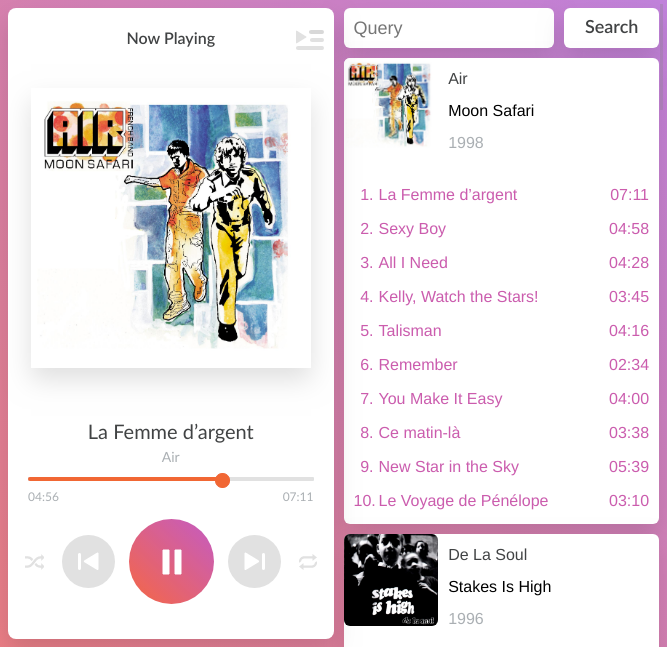

This is an alternate beets web UI player using AmplitudeJS. It requires the `web` plugin to be enabled.

Current features:
* find songs by `web`-API query
* add song to playlist
* add album to playlist
* delete song from playlist
* responsive layout

# Prerequisites
* beets with `web` plugin enabled

# Installation
1. `pip install git+https://github.com/4kind/beetsplug-tarkus`
2. enable plugin `tarkus` in beets config
3. start web UI with `beet web` (http://127.0.0.1:8337 as default)

# Uninstall
`pip uninstall tarkus`
